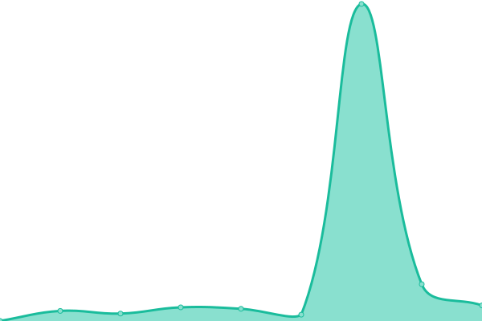
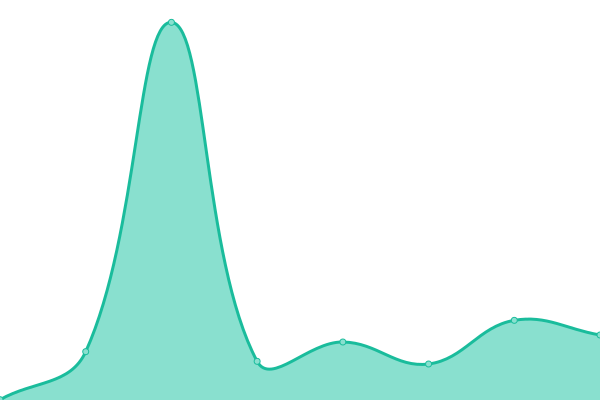

# [📈 Live Status](https://status.innovuarts.com): <!--live status--> **🟧 Partial outage**

This repository contains the open-source uptime monitor and status page for [INNARS S.A.C.](https://www.innovuarts.com/), powered by [Upptime](https://github.com/upptime/upptime).

With [Upptime](https://upptime.js.org), you can get your own unlimited and free uptime monitor and status page, powered entirely by a GitHub repository. We use [Issues](https://github.com/INNARSSAC/innarsupptime/issues) as incident reports, [Actions](https://github.com/INNARSSAC/innarsupptime/actions) as uptime monitors, and [Pages](https://status.innovuarts.com) for the status page.

<!--start: status pages-->
<!-- This summary is generated by Upptime (https://github.com/upptime/upptime) -->
<!-- Do not edit this manually, your changes will be overwritten -->
<!-- prettier-ignore -->
| URL | Status | History | Response Time | Uptime |
| --- | ------ | ------- | ------------- | ------ |
|  [Comer al toque](https://www.comeraltoque.com/) | 🟥 Down | [comer-al-toque.yml](https://github.com/INNARSSAC/innarsupptime/commits/HEAD/history/comer-al-toque.yml) | 

 0ms
     
 | 

<a href="https://status.innovuarts.com/history/comer-al-toque">0.00%</a>
    

|  [Sacrun SAC](https://www.sacrun.com/) | 🟩 Up | [sacrun-sac.yml](https://github.com/INNARSSAC/innarsupptime/commits/HEAD/history/sacrun-sac.yml) | 

 386ms
     
 | 

<a href="https://status.innovuarts.com/history/sacrun-sac">96.27%</a>
    

|  [Sacrun SAC Revistas](https://revista.sacrun.com/) | 🟩 Up | [sacrun-sac-revistas.yml](https://github.com/INNARSSAC/innarsupptime/commits/HEAD/history/sacrun-sac-revistas.yml) | 

 944ms
     
 | 

<a href="https://status.innovuarts.com/history/sacrun-sac-revistas">96.27%</a>
    

|  [INNARS](https://www.innovuarts.com) | 🟩 Up | [innars.yml](https://github.com/INNARSSAC/innarsupptime/commits/HEAD/history/innars.yml) | 

 651ms
     
 | 

<a href="https://status.innovuarts.com/history/innars">69.86%</a>
    

|  [Google](https://www.google.com) | 🟩 Up | [google.yml](https://github.com/INNARSSAC/innarsupptime/commits/HEAD/history/google.yml) | 

 115ms
     
 | 

<a href="https://status.innovuarts.com/history/google">100.00%</a>
    

|  [Discord](https://discord.com/) | 🟩 Up | [discord.yml](https://github.com/INNARSSAC/innarsupptime/commits/HEAD/history/discord.yml) | 

 111ms
     
 | 

<a href="https://status.innovuarts.com/history/discord">100.00%</a>
    

|  [Paisajista](https://paisajistapicanteria.com) | 🟥 Down | [paisajista.yml](https://github.com/INNARSSAC/innarsupptime/commits/HEAD/history/paisajista.yml) | 

 0ms
     
 | 

<a href="https://status.innovuarts.com/history/paisajista">0.00%</a>
    

<!--end: status pages-->

[**Visit our status website →**](https://status.innovuarts.com)

## 📄 License

- Powered by: [Upptime](https://github.com/upptime/upptime)
- Code: [MIT](./LICENSE) © [INNARS S.A.C.](https://www.innovuarts.com/)
- Data in the `./history` directory: [Open Database License](https://opendatacommons.org/licenses/odbl/1-0/)
